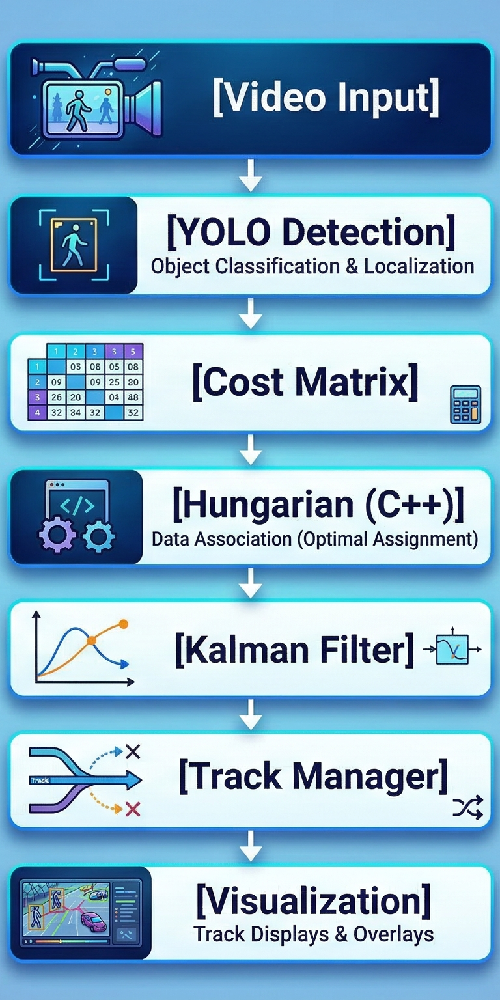
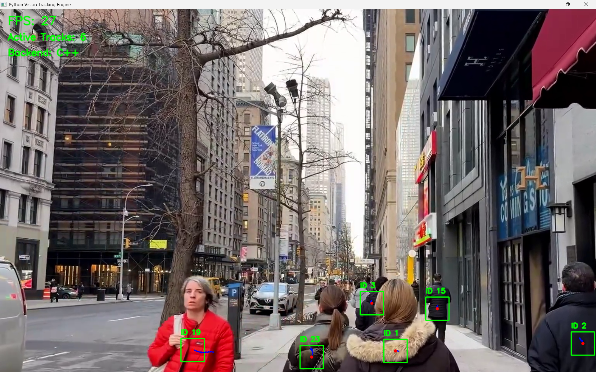

# Python Vision Tracking Engine


---

## 🚀 Overview

Real-time multi-object tracking system combining **Computer Vision, State Estimation, and C++ acceleration**.

This project implements a full end-to-end tracking pipeline:

* YOLOv8 object detection
* Kalman Filter (constant velocity model)
* Hungarian Algorithm (C++ accelerated)
* Multi-object tracking with stable ID assignment
* Real-time video processing and visualization

---

## 🎬 Demo


---

## 🧠 System Pipeline

```text
Video Input
→ YOLO Detection
→ Cost Matrix
→ Hungarian Assignment (C++)
→ Kalman Filter Update
→ Track Management
→ Visualization
```

---

## 🧩 Architecture



---

## 📦 Features

### 🔍 Detection

* YOLOv8 (Ultralytics)
* Real-time inference
* Confidence filtering
* Person-class tracking

### 📈 Tracking

* Kalman Filter (constant velocity model)
* State: `[x, y, vx, vy]`
* Smooth trajectory estimation

### 🔗 Data Association

* Hungarian Algorithm (optimal assignment)
* C++ backend via shared library
* Python fallback (SciPy)

### 🧬 Multi-Object Tracking

* Unique track IDs
* Track creation from detections
* Track deletion after missed frames
* Short-term occlusion handling

---

## ⚙️ Quick Start

```bash
pip install -r requirements.txt
python main.py
```

---

## 🏗️ Project Structure

```text
python-vision-tracking-engine/
│
├── main.py
├── config.py
├── requirements.txt
│
├── cpp/
│   ├── hungarian_bridge.cpp
│   ├── build_hungarian.ps1
│
├── src/
│   ├── detection/
│   ├── tracking/
│   ├── io/
│   └── visualization/
│
└── assets/
    ├── demo.gif
    ├── sample_output.png
    └── architecture.png
```

---

## ⚡ C++ Acceleration

Build Hungarian backend:

```bash
powershell -ExecutionPolicy Bypass -File .\\cpp\\build_hungarian.ps1
```

The system automatically selects:

* C++ backend (fast, optimal)
* Python fallback (safe)

---

## 🖼️ Example Output



---

## 📊 Performance

| Metric             | Value        |
| ------------------ | ------------ |
| FPS                | ~20–35       |
| Backend            | C++ / Python |
| Tracking Stability | High         |
| ID Switching       | Low          |

---

## 🧩 Engineering Highlights

* Real-time multi-object tracking pipeline
* Kalman-based motion estimation
* Optimal assignment via Hungarian algorithm
* Python ↔ C++ integration
* Modular and scalable architecture

---

## 🛠️ Technologies

* Python (OpenCV, NumPy, SciPy)
* YOLOv8 (Ultralytics)
* C++17 (Hungarian Algorithm)
* ctypes (Python ↔ C++ bridge)

---

## 📄 License

This project is licensed under the MIT License. See the `LICENSE` file for details.

---

## 👨‍💻 Author

**Ali Eray Kalaycı**
Computer Engineering
Focus: Computer Vision • Tracking Systems • Real-Time AI